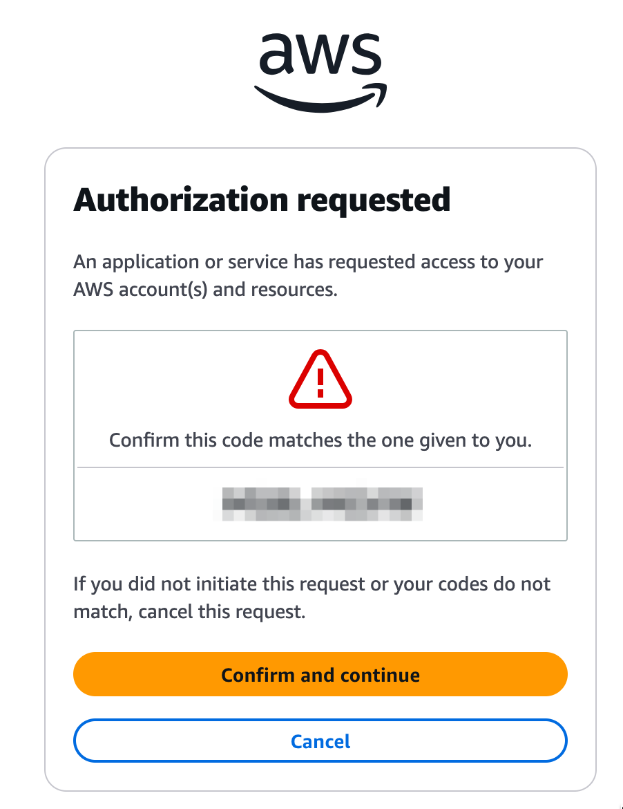

# 2. VSCode Server에 Q CLI 구성하기

***

## Amazon Q CLI 설치 가이드

Amazon Q Developer CLI는 Builder ID 또는 IAM Identity Center 계정으로 로그인하여 AI 기반 개발 도구를 사용할 수 있는 CLI 도구입니다.  이 가이드는 Linux 환경 (Amazon Linux 2023)에서 Q CLI를 설치하고 인증하는 방법을 단계별로 안내합니다.

***

### &#x20;1. glibc  버전 확인

```
ldd --version
```

| 버전            | 설치 대상                    |
| ------------- | ------------------------ |
| glibc 2.34 이상 |  표준(Standard) 버전 사용 가능   |
| glibc 2.34 미만 | musl 버전 사용 필요 (별도 문서 참고) |

> 💡 Amazon Linux 2023 + 최신 AWS CLI 설치 환경은 기본적으로 glibc 2.34 이상입니다.

***

### 2. Q CLI 다운로드 (glibc 2.34 이상 기준)

```
curl --proto '=https' --tlsv1.2 -sSf \
  "https://desktop-release.q.us-east-1.amazonaws.com/latest/q-x86_64-linux.zip" \
  -o "q.zip"
```

***

### 3. 압축 해제 및 설치

```
unzip q.zip
./q/install.sh
```

설치가 완료되면 Q CLI는 /usr/local/bin/q 경로에 등록됩니다.

> 최초 설치 시 로그인 방식 선택 및 인증 절차가 진행됩니다.

***

### 4. 로그인 방식 선택 및 인증

* Builder ID 로그인 (무료 사용)

```
✔ Do you want q to modify your shell config? → Yes
✔ Select login method → Use for Free with Builder ID

Confirm the following code in the browser:
Code: xxxx-xxxx  
Open this URL: https://view.awsapps.com/start/#/device?user_code=xxxx-xxxx
```

* IAM Identity Center (Pro 라이선스)

```
✔ Do you want q to modify your shell config? → Yes
✔ Select login method → Use with Pro license
✔ Enter Start URL → https://amzn.awsapps.com/start
✔ Enter Region → us-east-1

Confirm the following code in the browser:
Code: xxxx-xxxx  
Open this URL: https://amzn.awsapps.com/start/#/device?user_code=xxxx-xxxx
```

* 인증 요청 예시 화면

<div align="left"><figure><figcaption></figcaption></figure></div>

* 인증 완료 후 예시 화면

<div align="left"><figure><figcaption></figcaption></figure></div>

***

### 5. 로그인 재인증 또는 수동 로그인

```
q login --region us-east-1
```

> Builder ID 또는 SSO 로그인 방식 선택 가능

***

### 6. 설치 확인

```
q --version
```

정상적으로 설치되면 Q CLI의 버전 정보가 출력됩니다.

***

### 7. Q CLI 실행

```
q chat
```

실행 후 다음과 같이 AI 기반 대화형 개발 환경이 시작됩니다:

```
To learn more about MCP safety, see https://docs.aws.amazon.com/amazonq/latest/qdeveloper-ug/command-line-mcp-security.html

Welcome to 

 █████╗ ███╗   ███╗ █████╗ ███████╗ ██████╗ ███╗   ██╗     ██████╗ 
██╔══██╗████╗ ████║██╔══██╗╚══███╔╝██╔═══██╗████╗  ██║    ██╔═══██╗
███████║██╔████╔██║███████║  ███╔╝ ██║   ██║██╔██╗ ██║    ██║   ██║
██╔══██║██║╚██╔╝██║██╔══██║ ███╔╝  ██║   ██║██║╚██╗██║    ██║▄▄ ██║
██║  ██║██║ ╚═╝ ██║██║  ██║███████╗╚██████╔╝██║ ╚████║    ╚██████╔╝
╚═╝  ╚═╝╚═╝     ╚═╝╚═╝  ╚═╝╚══════╝ ╚═════╝ ╚═╝  ╚═══╝     ╚══▀▀═╝ 
                                                        


╭───────────────────────── Did you know? ─────────────────────────╮
│                                                                 │
│         You can use /editor to edit your prompt with a          │
│                       vim-like experience                       │
│                                                                 │
╰─────────────────────────────────────────────────────────────────╯


/help all commands  •  ctrl + j new lines  •  ctrl + k fuzzy search
━━━━━━━━━━━━━━━━━━━━━━━━━━━━━━━━━━━━━━━━━━━━━━━━━━━━━━━━━━━━━━━━━━━
```

***

### 💡 참고 사항

* Q CLI는 \~/.q 디렉토리에 사용자 설정을 저장합니다.
* Builder ID 계정은 [https://builder.aws](https://builder.aws) 에서 무료 생성 가능합니다.
* 프로파일, 컨텍스트, 도구(MCP) 연동은 이후 문서에서 다룹니다.

***

🎉 이제 Amazon Q CLI가 설치되었습니다! &#x20;
